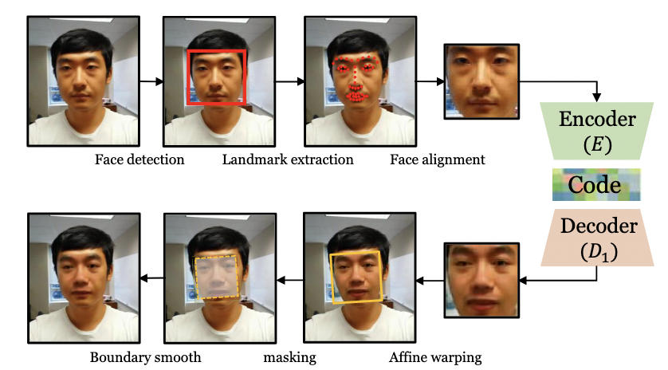
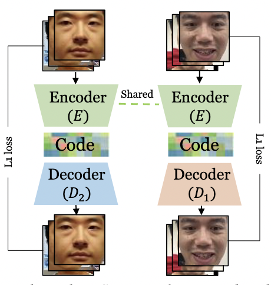

# Celeb-DF: A Large-scale Challenging Dataset for DeepFake Forensics

### Overview
Celeb-DF dataset includes 590 original videos collected from YouTube with subjects of different ages, ethic groups and genders, and 5639 corresponding DeepFake videos. 

### Dataset Structure
```commandline
Celeb-DF
|--- Celeb-real # 590 Celebrity videos downloaded from YouTube
|--- YouTube-real # 300 Additional videos downloaded from YouTube
|--- Celeb-synthesis # 5639 Synthesized videos from Celeb-real
|--- List_of_testing_videos.txt # 518 videos
```

### Deepfake Video Generation



The overall pipeline of the basic DeepFake maker is shown above. From an input video, faces of the target are detected, from which facial landmarks are further extracted. The landmarks are used to align the faces to a standard configuration. The aligned faces are then cropped and fed to an auto-encoder to synthesize faces of the donor with the same facial expressions as the original target’s faces.

The auto-encoder is usually formed by two convoluntional neural networks (CNNs), i.e., the encoder and the decoder. The encoder E converts the input target’s face to a vector known as the code. To ensure the encoder capture identity-independent attributes such as facial expressions, there is one single encoder regardless the identities of the subjects. On the other hand, each identity has a dedicated decoder Di, which generates a face of the corresponding subject from the code. 



The encoder and decoder are trained in tandem using uncorresponded face sets of multiple subjects in an unsupervised manner. Specifically, an encoder-decoder pair is formed alternatively using E and Di for input face of each subject, and optimize their parameters to minimize the reconstruction errors (`L1` difference between the input and reconstructed faces). The parameter update is performed with the back-propagation until convergence.

The synthesized faces are then warped back to the configuration of the original target’s faces and trimmed with a mask from the facial landmarks. The last step involves smoothing the boundaries between the synthesized regions and the original video frames. The whole process is automatic and runs with little manual intervention.

There have also been algorithms dedicated to the detection of Deep-Fake videos that fall into three categories. Methods in
the first category are based on inconsistencies exhibited in the physical/physiological aspects in the DeepFake videos. The method exploits the observation that many DeepFake videos lack reasonable eye blinking due to the use of online portraits as training data, which usually do not have closed eyes for aesthetic reasons. Incoherent head poses in DeepFake videos are utilized to expose DeepFake videos. The idiosyncratic behavioral patterns of a particular individual are captured by the time series of facial landmarks extracted from real videos are used to spot DeepFake videos. The second category of DeepFake detection algorithms use signal-level artifacts introduced during the synthesis process. The third category of DeepFake detection methods are data-driven, which directly employ various types of DNNs trained on real and DeepFake videos, not relying on any specific artifact.

### Celeb-DF Synthesis Method

The DeepFake videos in Celeb-DF are generated using an improved DeepFake synthesis algorithm, which is key to the improved visual quality.

#### Low resolution of synthesized faces

The basic DeepFake maker algorithm generate low-resolution faces (typically 64 × 64 or 128 × 128 pixels). 
From the paper,
>We improve the resolution of he synthesized face to 256 × 256 pixels. This is achieved by using encoder and decoder models with more layers and increased dimensions. 

The higher resolution of the synthesized faces are of better visual quality and less affected by resizing and rotation operations in accommodating the input target faces.

#### Color Mismatch

Color mismatch between the synthesized donor’s face with the original target’s face in Celeb-DF is significantly reduced by training data augmentation and post processing.

From the paper,
> Specifically, in each training epoch, we randomly perturb the colors of the training faces, which forces the DNNs to synthesize an image containing the same color pattern with input image. We also apply a color transfer algorithm between the synthesized donor face and the input target face.

#### Inaccurate face masks

In previous datasets, the face masks are either rectangular, which may not completely cover the facial parts in the original video frame, or the convex hull of landmarks on eyebrow and lower lip, which leaves the boundaries of the mask visible.

From the paper,
> We first synthesize a face with more surrounding context, so as to completely cover the original facial parts after warping. We then create a smoothness mask based on the landmarks on eyebrow and interpolated points on cheeks and between lower lip and chin.

#### Temporal flickering

The temporal sequence of the face landmarks are filtered using a Kalman smoothing algorithm to reduce imprecise variations of landmarks in each frame.