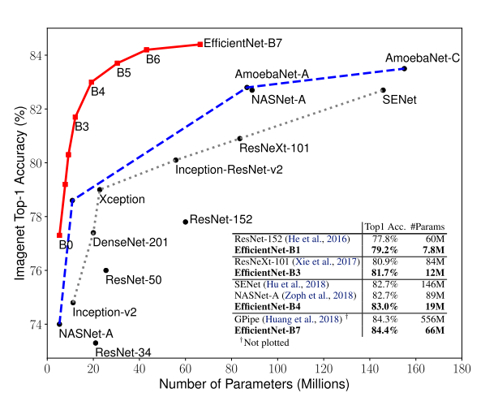
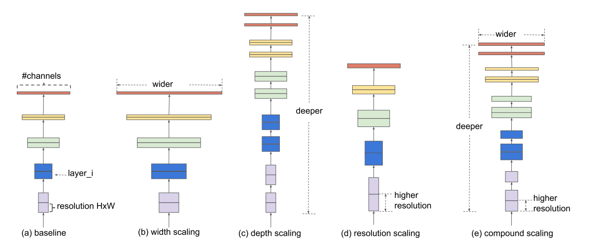
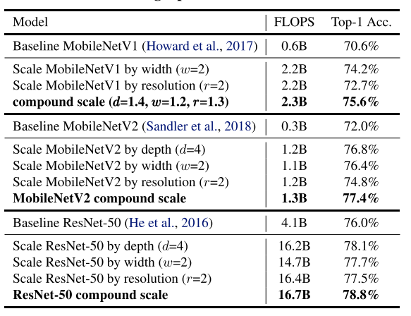
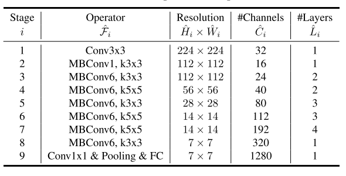
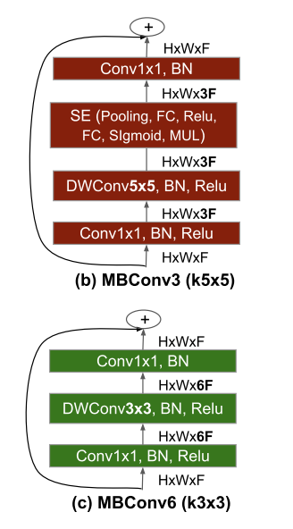
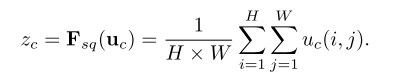
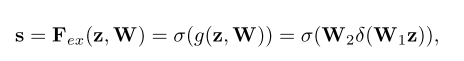

# EfficientNet: Rethinking Model Scaling for Convolutional Neural Networks

### Introduction

From the paper,
> EfficientNet-B7 achieves state- of-the-art 84.4% top-1 / 97.1% top-5 accuracy on ImageNet, while being 8.4x smaller and 6.1x faster on inference than the best existing ConvNet. Our EfficientNets also transfer well and achieve state-of-the-art accuracy on CIFAR-100 (91.7%), Flowers (98.8%), and 3 other transfer learning datasets, with an order of magnitude fewer parameters.

As we can see from the above figure, EfficientNets significantly outperform other ConvNets. In fact, EfficientNet-B7 achieved new state of art with 84.4% top-1 accuracy outperforming the previous SOTA GPipe but being 8.4 times smaller and 6.1 times faster.

## How EfficientNets work

### Compound Scaling

The most common way to scale up ConvNets was either by one of three dimensions - depth (number of layers), width (number of channels) or image resolution (image size). EfficientNets on the other hand perform Compound Scaling - that is, scale all three dimensions while mantaining a balance between all dimensions of the network.

From the paper,

> Our empirical study shows that it is critical to balance all dimensions of network width/depth/resolution, and surprisingly such balance can be achieved by simply scaling each of them with constant ratio. Based on this observation, we propose a simple yet effective compound scaling method. Unlike conventional practice that arbitrary scales these factors, our method uniformly scales network width, depth, and resolution with a set of fixed scaling coefficients.

This idea of compound scaling makes sense too because if the input image is bigger (input resolution), then the network needs more layers (depth) and more channels (width) to capture more fine-grained patterns on the bigger image.

Performance of ResNet and MobileNet with compound scaling:

Observations from scaling depth, width and image resolutions:
> 1. Scaling up any dimension of network width, depth, or resolution improves accuracy, but the accuracy gain diminishes for bigger models.
> 2. In order to pursue better accuracy and efficiency, it is critical to balance all dimensions of network width, depth, and resolution during ConvNet scaling.

#### Depth

Scaling network depth (number of layers), is the most common way used by many ConvNets.

With the advancements in deep learning (particularly thanks to Residual Connections, BatchNorm), it has now been possible to train deeper neural networks that generally have higher accuracy than their shallower counterparts. The intuition is that deeper ConvNet can capture richer and more complex features, and generalize well on new tasks. However, deeper networks are also more difficult to train due to the vanishing gradient problem. Although residual connections and batchnorm help alleviate this problem, the accuracy gain of very deep networks diminishes. For example, ResNet-1000 has similar accuracy as ResNet-101 even though it has much more layers.

#### Width

Scaling network width - that is, increasing the number of channels in Convolution layers - is most commonly used for smaller sized models. We have seen applications of wider networks previously in MobileNets, MNasNet.

While wider networks tend to be able to capture more fine-grained features and are easier to train, extremely wide but shallow networks tend to have difficulties in capturing higher level features.

#### Resolution

Increasing image resolution to help improve the accuracy of ConvNets is not new - Progressive Resizing. It is also beneficial to ensemble models trained on different input resolution.

From the paper, 
> With higher resolution input images, ConvNets can potentially capture more fine-grained patterns. Starting from 224x224 in early ConvNets, modern ConvNets tend to use 299x299 (Szegedy et al., 2016) or 331x331 (Zoph et al., 2018) for better accuracy. Recently, GPipe (Huang et al., 2018) achieves state-of-the-art ImageNet accuracy with 480x480 resolution. Higher resolutions, such as 600x600, are also widely used in object detection ConvNets (He et al., 2017; Lin et al., 2017).

### The EfficientNet Architecture using NAS

The authors used Neural Architecture Search approach similar to MNasNet research paper. This is a reinforcement learning based approach where the authors developed a baseline neural architecture Efficient-B0 by leveraging a multi-objective search that optimizes for both Accuracy and FLOPS. From the paper,

The EfficientNet-B0 architecture has been summarized in below:

The MBConv layer above is nothing but an inverted bottleneck block with squeeze and excitation connection added to it.

As in the case of Bottleneck layers that were introduced in the InceptionV2 architecture, the key idea is to first use a `1x1` convolution to bring down the number of channels and apply the `3x3` or `5x5` convolution operation to the reduced number of channels to get output features. Finally, use another `1x1` convolution operation to again increase the number of channels to the initial value. Bottleneck design used in ResNets has been shown below.

The inverted bottleneck as in MBConv does the reverse - instead of reducing the number of channels, the first `1x1` conv layer increases the number of channels to 3 times the initial.

Note that using a standard convolution operation here would be computationally expensive, so a Depthwise Convolution is used to get the output feature map. Finally, the second 1x1 conv layer downsamples the number of channels to the initial value. 

From the paper,

>The main building block of EfficientNet-B0 is mobile inverted bottleneck MBConv (Sandler et al., 2018; Tan et al., 2019), to which we also add squeeze-and-excitation optimization (Hu et al., 2018).

#### Squeeze: Global Information Embedding

The main purpose of the Squeeze operation is to extract global information from each of the channels of an image. Since, convolution is a local operation (that is, at a particular time, it is only able to see a part of the image), it might be beneficial to also extract information outside the receptive field of the convolution filter.

The Squeeze operation is meant to do exactly that and the authors keep it as simple as possible.

The authors perform a Global Average Pooling operation to reduce the `C x H x W` image to `C x 1 x 1` to get a global statistic for each channel. Formally, the Global Average Pooling or the Squeeze operation can be formally represented as:

In other words, all we do is that we take the mean of each channel across `H x W` spatial dimensions.

#### Excitation: Adaptive Recalibration

Now that we have a vector of length `C` from the Squeeze operation, the next step is to generate a set of weights for each channel. This is done with the help of Excitation operation explained in this section.

Formally, the excitation operation can be represented by:

where:
- `δ` refers to ReLU operation
- `σ` refers to Sigmoid operation
- `W1` and `W2` are two fully-connected layers
- `z` is the output from the Squeeze block

## EfficientNets with LSTM

Architecture inspired by [DeeperForensics-1.0: A Large-Scale Dataset for Real-World Face Forgery Detection](https://arxiv.org/pdf/2001.03024.pdf)

> ResNet+LSTM is based on ResNet architecture. As a 2D convolutional framework, ResNet is used to extract spatial features (the output of the last convolutional layer) for each face image. In order to encode the temporal dependency between images,
we place an LSTM module with 512 hidden units after ResNet-50 to aggregate the spatial features. An additional fully connected layer serves as the classifier. All the videos are downsampled with a ratio of 5, and the images are resized to 224 × 224 before feeding into the network. During training, the loss is the summation of the binary entropy on the output at all
time steps, while only the output of the last frame is used for the final classification in inference.

Implementation of EfficientNetB1 + LSTM was part of the Deepfake Detection Challenge Rank 90 private leaderboard solution: 

[Deepfake Detection Challenge](https://www.kaggle.com/c/deepfake-detection-challenge)

